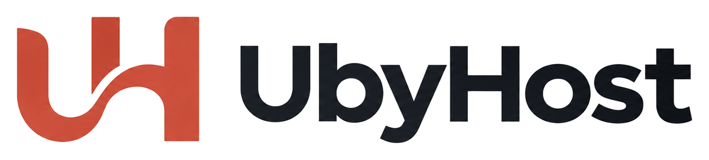

# UbyHost logo standards

This is the locked identity for anyone shipping UI, e-mail, or marketing
materials. Do not invent a replacement mark, alter the ligature, or swap in a
previous candidate. Light-mode surfaces only — see [DESIGN.md](DESIGN.md).

The generation brief that produced the family lives in
[LOGO_PROMPT.md](LOGO_PROMPT.md). It is historical. These files and placements
are the standard now.

## The mark

A coral **U–H ligature**: a rounded U on the left whose bowl continues as a
single S-curve into the crossbar and stem of an H on the right. One flat color,
no outline, no plate, no badge.

- **Name spelling:** `UbyHost` — capital U, lowercase `by`, capital H, lowercase
  `ost`. One word. Never `Uby Host`, `UbyHosts`, `UByHost`, or `Ubyhost`.
- **Tagline (copy, not the logo):** “Guest reporting, handled for you.”
- **Legal:** UbyHost is a private product. The mark must not be redrawn as a
  police badge, ministry seal, or national emblem, and must not imply official
  endorsement.

## Three versions

Use the version that matches the slot. Do not mix them (for example, do not put
the stacked lockup in the sidebar).

| Version | What it is | Preview |
| --- | --- | --- |
| **Mark only** | The ligature, square. Favicon, sidebar, mobile bar, onboarding. |  |
| **Horizontal lockup** | Mark to the left of the wordmark. Login form, e-mail. |  |
| **Stacked lockup** | Mark above the wordmark. Login hero only. |  |

The stacked lockup does **not** include the tagline. The login hero already
prints “Guest reporting, handled for you.” as a headline under the image — do
not add the tagline to the artwork.

In the desktop sidebar, the mark sits next to the word **UbyHost** set in live
CSS (`.brand-word`), not baked into the PNG. That keeps the name sharp at 17 px.

## Color

| Role | Hex | Token |
| --- | --- | --- |
| Mark (coral) | `#D35445` | close to `--brand: #c85a52`; keep the artwork as shipped |
| Wordmark (ink) | `#1B1F25` | close to `--ink: #20201e` |
| Canvas | `#F7F7F5` | `--canvas` |
| Surface | `#FFFFFF` | `--surface` |

One color only in the mark. Do not add a second brick, a gradient, a drop
shadow, or a white tile behind it.

Artwork files are transparent PNGs (white canvas removed). Keep
`mix-blend-mode: multiply` on light product surfaces as a belt-and-braces
anti-aliasing aid. Do not reintroduce opaque white fills: they show as boxes
whenever the mark sits on a tinted surface. The e-mail JPEG keeps a baked-in
white canvas on purpose.

## Files

All live under `App/app/static/`.

| File | Version | Use |
| --- | --- | --- |
| `ubyhost-mark.png` | Mark only, 512 × 512 | Sidebar, mobile app bar, onboarding, landing accents |
| `ubyhost-logo.png` | Horizontal, 1200 × 272 | Login form (left), public landing and guide headers |
| `ubyhost-logo-stacked.png` | Stacked, 900 × 746 | Login hero (right) |
| `ubyhost-logo.jpg` | Horizontal on white | E-mail / signature |
| `favicon.png` | Mark only, 64 × 64 | Browser tab (host, guest, auth) |
| `apple-touch-icon.png` | Mark on `#F7F7F5`, 180 × 180 | Home screen |
| `favicon.svg` | Retired | Do not point new pages at it |

`/favicon.ico` redirects to `/static/favicon.png`.

Templates:

- Login / password: `App/app/templates/auth_base.html`
- Host chrome: `App/app/templates/base.html`
- Guest form: `App/app/templates/guest/base.html`
- Public landing / guide: `App/app/templates/landing.html`, `public_guide.html`
- Onboarding card: `App/app/templates/_components.html`

## Placements and display sizes

Sizes are CSS display sizes in `App/app/static/app.css`. Assets are already
large enough for 2× screens.

| Placement | File | CSS | Display | Background |
| --- | --- | --- | --- | --- |
| Login form, above the fields | `ubyhost-logo.png` | `.auth-logo` | **220 px** wide (`min(220px, 70vw)`) | `#F7F7F5` |
| Login hero, above the description | `ubyhost-logo-stacked.png` | `.auth-hero-mark` | **300 px** wide (`min(300px, 100%)`) | `#FFFFFF` → `#F1F1EF` with a faint coral wash |
| Admin sidebar, top left | `ubyhost-mark.png` + live “UbyHost” | `.sidebar-brand .brand-logo` | **28 × 28 px** | lavender-tinted white → `#FFFFFF` |
| Mobile app bar | `ubyhost-mark.png` | `.appbar .brand-logo` | **24 × 24 px** | translucent white |
| Onboarding welcome | `ubyhost-mark.png` | `.onboarding-logo` | **120 px** wide | `#FFFFFF` with a faint coral wash |
| Public landing / guide header | `ubyhost-logo.png` | `.landing-brand img` | **152 px** wide | `#F7F7F5` |
| Landing product mock (sidebar accent) | `ubyhost-mark.png` | `.product-shell aside img` | **28 × 28 px** | lavender-tinted white |
| Landing final CTA | `ubyhost-mark.png` | `.landing-final img` | **64 × 64 px** | warm canvas wash |
| Browser tab | `favicon.png` | `<link rel="icon">` | **64 × 64** (browser scales to ~16–32) | transparent |
| Home screen | `apple-touch-icon.png` | `<link rel="apple-touch-icon">` | **180 × 180** | `#F7F7F5` |
| E-mail signature | `ubyhost-logo.jpg` | `width="180"` HTML attribute | **180 px** wide | baked-in white |

Transactional mail is still plain text today, so `ubyhost-logo.jpg` is shipped
for signatures / future HTML mail but is not referenced by templates yet.

The login hero is hidden below 900 px; the left-hand horizontal lockup is the
only logo on small screens.

## Do

- Keep clear space around the mark roughly a quarter of its height.
- Prefer the mark-only file below ~40 px of display height.
- Keep `mix-blend-mode: multiply` on `.brand-logo`, `.auth-logo`,
  `.auth-hero-mark`, `.onboarding-logo`, `.landing-brand img`,
  `.product-shell aside img`, and `.landing-final img` as a light-surface
  safeguard.
- Bump the `app.css?v=` / `landing.css?v=` cache query in the templates if you
  replace a file in place.

## Do not

- Stretch, outline, rotate, or recolor the ligature.
- Put the mark on a coral rounded square except if we later ship a dedicated
  app-icon export.
- Set the mark on a dark product surface (the product is light-only).
- Use the stacked lockup anywhere except the login hero.
- Bake “UbyHost” into the 28 px sidebar asset — keep live type.
- Restore `favicon.svg` or the old U-swoosh files.
- Describe or attach retired candidates (including the house-and-form
  exploration in `docs/assets/logo-mark-selected.jpg`) when generating new
  exports of *this* identity. Trace the shipped PNGs instead.

## Replacing an export

1. Keep the ligature geometry. Recolor only to `#D35445` / `#1B1F25` if the
   generator drifted.
2. Crop empty margin; square the mark; export a **transparent** PNG (and JPEG
   on white for mail). Opaque white fills show as boxes on tinted surfaces.
3. Overwrite the matching file in `App/app/static/`.
4. If the new PNG is truly transparent, you can drop `mix-blend-mode: multiply`.
5. Update this document if sizes or slots change.
