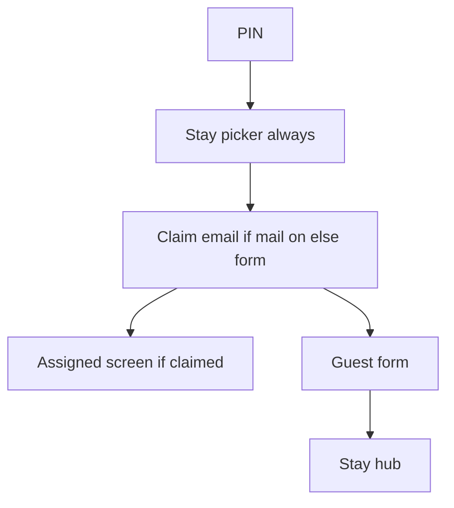

# Next mail production release (full backlog)

This is the product release plan for turning guest e-mail back on and shipping the related UX. Cursor also keeps a copy under Plans as `mail_go_live_next_release_422b841b`.

**Do not merge release PRs until this plan is approved.** Drafts [#87](https://github.com/jsfpechar-ops/jsfpecharoperations/pull/87) (passport) and [#88](https://github.com/jsfpechar-ops/jsfpecharoperations/pull/88) (claim caps + DESIGN notes) stay parked until then.

**Related:** [DESIGN.md](DESIGN.md) (Arrival-lane picker, assigned screen, PM contact footer).

## Status snapshot

| Item | Status |
|------|--------|
| SES `_send_ses` + boto3 on production | Done (`#86`); mail still **disabled** |
| Domain DKIM / MAIL FROM / DMARC | Done (ops); Essentials; no dedicated IP |
| Claim-mail abuse caps | Code-complete on `cursor/claim-mail-abuse-caps-3387` / #88 |
| Arrival-lane picker **spec** | Written in DESIGN.md; UI not built yet |
| SES flip to `ses` | Waiting on AWS production access |
| Always-show picker, assigned UX, PM checkbox, passport toggle | Not built / not merged |

---

## Already done

- SES sender + `boto3` on production (`#86` / `1e7edf3`); Lightsail healthy
- Production **`UBYHOST_MAIL_BACKEND=disabled`** (PIN → dates → form)
- Domain DNS: DKIM + MAIL FROM `mail.ubyhost.com` + DMARC `p=none`
- IAM keys may be staged in Lightsail `.env` while mail stays disabled
- `noreply@ubyhost.com` = From only (no mailbox required); Reply-To = legal entity

---

## Owner ops (block SES flip)

1. AWS production-access approval (Support reply with transactional use case if needed)
2. Confirm DKIM / MAIL FROM Verified; IAM can send
3. Only then: set `UBYHOST_MAIL_BACKEND=ses`, redeploy, smoke one claim email
4. Rollback: set `disabled` + redeploy

---

## Ship in one go-live (code)

### 1. Claim-mail abuse caps (before or with SES flip)

On `cursor/claim-mail-abuse-caps-3387` / [#88](https://github.com/jsfpechar-ops/jsfpecharoperations/pull/88):

- No re-send for same provisional email unless explicit Resend + **5 min** cooldown
- Per recipient **2/hour**, per reservation **3/hour**, IP+token **3/15 min**
- Production Turnstile on claim/resend (`guest_claim`)
- EN/CS errors: cooldown, recipient_rate, bot

### 2. Restore mail-backed guest features (when `ses` on)

Flipping SES turns these back on via `mail.mail_enabled()`:

- Email claim + magic-link confirm
- Masked email on assigned; none when locked
- Day-before guest reminder; host incomplete warnings
- Completion receipt + host CC; Reply-To = PM entity
- GDPR/cookie copy for claim email
- Contact split; custom host message; 24h grace; completion-based reporting

**Stay off unless toggled:** passport (see §5).

### 3. Always show stay picker

Remove `len(reservations) == 1` redirect in `pick_stay`. Always render picker after PIN when ≥1 stay. Empty stay → `/new` only **after** guest taps a stay.

### 4. Stay picker redesign — “Arrival lane”

Specified in [DESIGN.md](DESIGN.md). Summary:

1. Welcome + one legal sentence; **facility name** as hero signal
2. Soft welcome/accommodation band (not a card stack)
3. Chronological **arrival lane** rows: check-in→check-out range cue, nights, Ongoing badge, CTA **That’s my stay** / **To je můj pobyt**
4. PM footer: can’t find stay → contact host (legal-entity phone/email)

Motion: staggered entrance, range accent on focus, soft press. Not an Airbo clone.

### 5. Optional passport toggle (default Off)

Fold [#87](https://github.com/jsfpechar-ops/jsfpecharoperations/pull/87): Off | Required for foreign guests. Ship **with** mail go-live, not alone.

### 6. Assigned / already-claimed screen

- Property + location + dates summary
- Masked email + private-link guidance (optional last-sent date)
- **Send me the link again** (caps + Turnstile)
- Back / not my reservation
- Footer: **If there is any problem, feel free to contact your host** → **PM / legal-entity** phone + email (never `support@`)

### 7. PM = controller + PoC

- Default-ticked: “Property manager’s company is data controller (and guest PoC)”
- Unticked: second legal-entity form for controller; PoC stays PM unless host opts otherwise
- UbyPort IČO may diverge from GDPR controller → counsel note

### 8. Docs / i18n

DESIGN picker + assigned notes (done); implement EN/CS strings in go-live build. Staging stays `console`.

---

## Explicit non-goals this release

- Dedicated SES IPs / Pro plan / Auto Validation / SES tenants
- Cloning Airbo branding or pink-purple CTAs
- Dark mode
- Merging #87 or #88 before this umbrella is approved

---

## Execution order (when you say go)

1. Land claim-mail caps → deploy still `disabled`
2. Build umbrella: picker always-on + Arrival lane, assigned screen, PM checkbox, passport toggle, i18n
3. Owner: SES production access → flip `.env` to `ses` → redeploy → smoke claim/reminder/completion
4. One reviewable release PR (or stacked under this plan) — **not before approval**
