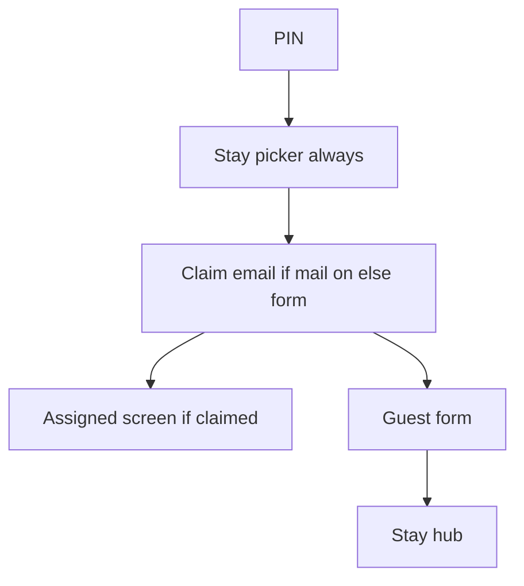

# UbyHost 1.1.0 — next mail production release

This is the release record and go-live checklist for UbyHost 1.1.0. It turns
guest e-mail back on and ships the related guest, host, privacy, and reporting
changes. UbyPort is the external police service; **1.1.0 is the UbyHost
application version**, not an UbyPort version.

**Landed 2026-09-21.** [#88](https://github.com/jsfpechar-ops/jsfpecharoperations/pull/88) is merged (merge commit `2986ebe`) and UbyHost 1.1.0 is deployed to production at `https://ubyhost.com`, with guest e-mail enabled (`UBYHOST_MAIL_BACKEND=ses`). The **Remaining release steps** and **Required regression analysis** sections below are the outstanding post-release items. The former passport draft [#87](https://github.com/jsfpechar-ops/jsfpecharoperations/pull/87) has been folded into #88.

**Related:** [DESIGN.md](DESIGN.md) (Arrival-lane picker, assigned screen, PM contact footer).

## Status snapshot

| Item | Status |
|------|--------|
| UbyHost application version | **1.1.0** |
| Terms / Privacy Policy / DPA | **1.5**, coordinated EN/CS update with controller/PoC roles and public subprocessor register |
| SES `_send_ses` + boto3 on production | Done (`#86`); live in production since 2026-09-21 |
| Domain DKIM / MAIL FROM / DMARC | Done (ops); Essentials; no dedicated IP |
| Claim-mail abuse caps | Implemented in #88 |
| Arrival-lane picker | Implemented in #88; always shown, including one stay |
| SES flip to `ses` | **Done 2026-09-21** — Lightsail `.env` flipped and confirmed in the running container; first real delivery still to confirm |
| Assigned UX, PM/controller split, passport toggle | Implemented and tested in #88 |
| First-time host onboarding + safe two-property demo | Implemented in EN/CS; skip/restore supported; finish handoff shows guest link + PIN; demo blocked against real UbyPort |
| Full regression suite | **729 passed** on the Phase 6 branch; from `App/`, `.venv/bin/python -m pytest tests -q -p no:logging` |

---

## Already done

- SES sender + `boto3` on production (`#86` / `1e7edf3`); Lightsail healthy
- Production `UBYHOST_MAIL_BACKEND=ses` since 2026-09-21 (PIN → stay picker → party count + e-mail → claim mail)
- Domain DNS: DKIM + MAIL FROM `mail.ubyhost.com` + DMARC `p=none`
- IAM keys live in the Lightsail `.env` only (never committed)
- `noreply@ubyhost.com` = From only (no mailbox required); Reply-To = legal entity

---

## Owner ops (SES flip — completed 2026-09-21)

1. AWS production-access approval — granted
2. DKIM / MAIL FROM verified; IAM can send
3. `UBYHOST_MAIL_BACKEND=ses` set on the VM and redeployed; container confirmed on `ses`
4. Rollback: set `disabled` + redeploy

---

## Included in #88

### 1. Claim-mail abuse caps (before or with SES flip)

Implemented on `cursor/claim-mail-abuse-caps-3387` / [#88](https://github.com/jsfpechar-ops/jsfpecharoperations/pull/88):

- No re-send for same provisional email unless explicit Resend + **1 min** cooldown
- Per recipient **5/hour**, per reservation **8/hour**, IP+token **10/15 min**
  (loosened after the SES go-live — the original 2/3 per hour with a 5 min
  cooldown locked real guests out after one or two attempts. Values live in
  `App/app/claim.py`; the IP+token throttle is in `App/app/routes/guest.py`.)
- A different address may take a stay over once its provisional hold is older
  than `HOLD_TAKEOVER_SECONDS` (**60 s**), not only after the full 30-minute
  hold, so a mistyped address stays recoverable
- Production Turnstile on claim/resend (`guest_claim`)
- EN/CS errors: cooldown, recipient_rate, bot

### 2. Restore mail-backed guest features (when `ses` on)

Flipping SES turns these back on via `mail.mail_enabled()`:

- Email claim + magic-link confirm
- Masked email on assigned; none when locked
- Day-before guest reminder; host incomplete warnings
- Completion receipt + host CC; Reply-To = PM entity
- GDPR/cookie copy for claim email
- Contact split; custom host message; completion-based reporting
- Incomplete claimed forms stay open after check-in until the guest finishes or the host locks them (`#89`); stay-specific links recover past incomplete stays

**Stay off unless toggled:** passport (see §5).

### 3. Always show stay picker

The `len(reservations) == 1` redirect is removed. The picker renders after PIN when ≥1 stay. Empty stay → `/new` only **after** the guest taps a stay.

### 4. Stay picker redesign — “Arrival lane”

Implemented from [DESIGN.md](DESIGN.md). Summary:

1. Welcome + one legal sentence; **facility name** as hero signal
2. Soft welcome/accommodation band (not a card stack)
3. Chronological **arrival lane** rows: check-in→check-out range cue, nights, Ongoing badge, CTA **That’s my stay** / **To je můj pobyt**
4. PM footer: can’t find stay → contact host (legal-entity phone/email)

Motion: staggered entrance, range accent on focus, soft press. Not an Airbo clone.

### 5. Optional passport toggle (default Off)

Folded from [#87](https://github.com/jsfpechar-ops/jsfpecharoperations/pull/87): Off | Required for foreign guests. Default remains **Off**.

### 6. Assigned / already-claimed screen

- Property + location + dates summary
- Masked email + private-link guidance (optional last-sent date)
- **Send me the link again** (caps + Turnstile)
- Back / not my reservation
- Footer: **If there is any problem, feel free to contact your host** → **PM / legal-entity** phone + email (never `support@`)

### 7. PM = controller + PoC

- Default-ticked: “Property manager’s company is data controller (and guest PoC)”
- Unticked: select the alternate controller legal entity; the PM remains the guest stay contact
- UbyPort IČO may diverge from GDPR controller → counsel note

### 8. Help, legal, privacy, DPA, cookies, and form information

The release is not complete if only the workflow code changes. PR #88 also
updates and regression-checks:

| Surface | Required 1.1.0 coverage |
|---|---|
| Host Help | Claim/resend flow, late incomplete forms, exact guest-cookie durations, optional passport policy, completion-based reporting, PM/controller roles |
| Guest form | Collected fields, declared-party purpose, conditional passport upload, legal acknowledgement, controller contact, host contact |
| Guest privacy notice | E-mail purpose/recipients/masking/retention, necessary cookies, conditional passport processing, UbyPort recipients, rights |
| Terms | Controller/processor roles, automatic reporting behavior, service integrations, cross-links |
| Privacy Policy | Host and guest data categories, exact application cookie lifetimes, SES/subprocessors, retention, security |
| DPA | Controller instructions, transactional mail, declared party size, optional document files, UbyPort transmission, subprocessors |
| Legal/operator page | Dynamic software-operator identity and links to Terms, Privacy Policy, and DPA |
| Deployment/security docs | SES activation, rollback, environment separation, smoke and post-release checks |

The application reports `1.1.0` in Settings and `/healthz`. Terms, Privacy
Policy, and DPA display version `1.5`; host-login audit entries record the same
three legal versions. Staging stays `console`.

### 9. Host chrome, onboarding finish, and demo walkthrough

- Sidebar property letter marks wrap up to **8** visible chips; further
  properties open via a `+N` control into the command palette (light mode only).
- Completing all five onboarding steps shows a finish handoff: copyable guest
  permalink + PIN, pointers to Communication (host message + passport policy),
  and skip/reopen guidance (EN/CS).
- Mock-only demo: Vinohrady Studio (`246810`) and Karlín Loft (`135790`) cover
  claim/assigned/late/locked, passport off vs required (with a sample photo
  awaiting review), controller split, manual vs scheduled, Czech vs foreign,
  house book, guest message, PIN, cancelled stay, and calendar blocks.

**Staging (how the acceptance run was done):** no auto-deploy hook. The branch
`cursor/claim-mail-abuse-caps-3387` was deployed to **ubyhost-staging only**,
with `UBYHOST_MAIL_BACKEND=console` and UbyPort on `mock`, before the production
flip. Staging stays on `console`.

---

## Explicit non-goals this release

- Dedicated SES IPs / Pro plan / Auto Validation / SES tenants
- Cloning Airbo branding or pink-purple CTAs
- Dark mode
- Enabling SES before AWS production access and an owner-approved deployment

---

## Remaining release steps

1. ~~Review and merge #88 when the owner asks~~ Done 2026-09-21 (merge commit `2986ebe`); 1.1.0 deployed to production
2. ~~Receive AWS SES production access and credentials~~ Done
3. ~~Set `.env` to `UBYHOST_MAIL_BACKEND=ses`, redeploy~~ Done; `ses` confirmed in the running container
4. **Outstanding:** smoke claim / resend / reminder / completion mail with one real guest journey
5. Roll back to `disabled` immediately if delivery or configuration is unhealthy

---

## Required regression analysis immediately after release

The release is not considered closed when deployment succeeds. Record a
post-release regression report against the exact deployed commit:

1. Confirm Settings and `/healthz` show UbyHost `1.1.0`; confirm the public
   Terms, Privacy Policy, and DPA show `1.5` in both EN and CS.
2. Confirm deployment is `production`, the public URL is
   `https://ubyhost.com`, and UbyPort remains on the owner-approved target.
3. Verify database migration health and compare critical row counts with the
   pre-deploy backup; do not accept unexplained reservation, guest, claim,
   outbox, submission, or legal-entity loss.
4. Run the complete automated suite plus production-safe remote smoke checks.
5. Exercise one controlled guest journey: PIN → always-visible stay picker →
   party count → claim e-mail → magic-link confirmation → individual forms →
   completion receipt. Verify masking, resend caps, controller notice, PM
   contact, necessary-cookie copy, and optional passport behavior.
6. Verify incomplete past-stay recovery, explicit host lock/reopen, iCal
   update/cancellation behavior, all three reporting modes, duplicate guards,
   and Doručenka/report history.
7. Review SES outbox failures, application alerts, scheduler output, and
   delivery feedback. Confirm no staging or test recipient was contacted.
8. Test the documented rollback by confirming the previous revision and
   `UBYHOST_MAIL_BACKEND=disabled` recovery path are available.

The report must list the deployed commit, environment values (without secrets),
test/smoke results, mail evidence, database-count comparison, defects found,
and the final go/no-go decision. Any material discrepancy keeps the release
open and disables SES until corrected.
