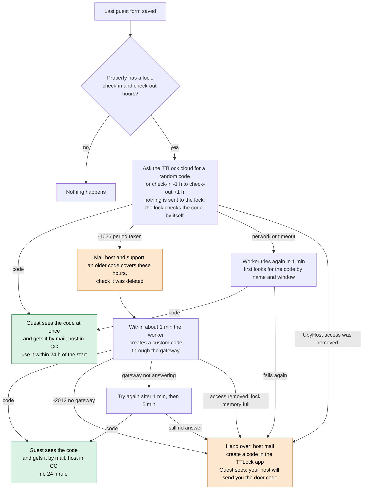
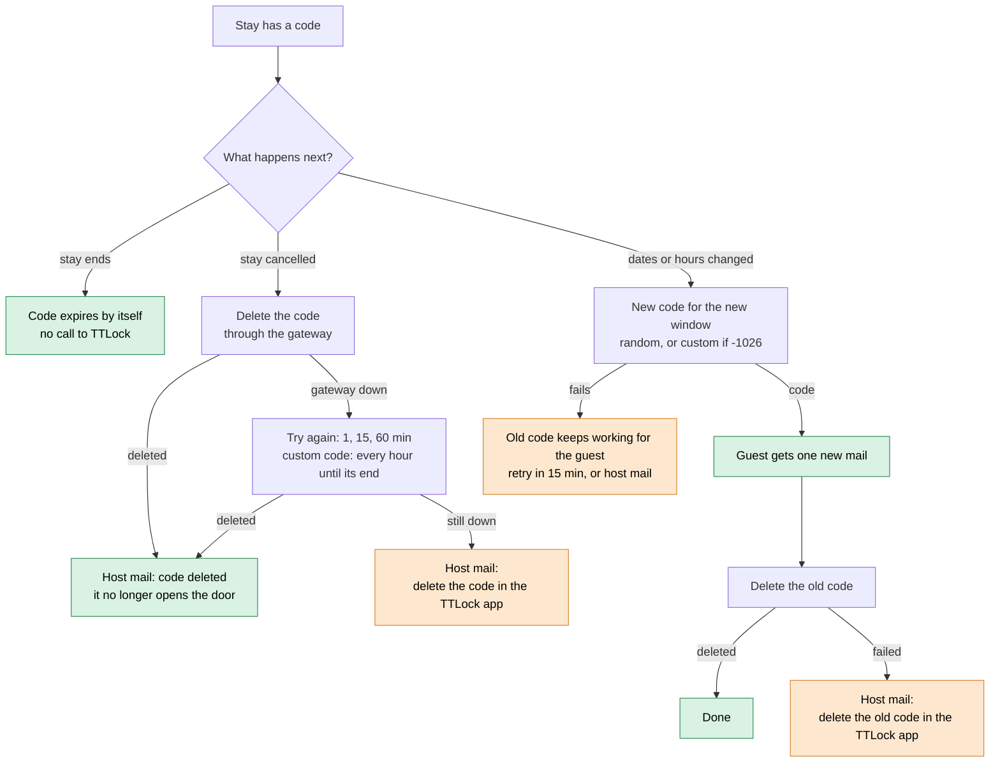

# Door code flow (picture)

The rules behind each box are in [ttlock-door-codes](ttlock-door-codes.md) §6. Green: the guest has a code. Orange: the host is mailed (support in copy) and makes the code in the TTLock app.

## 1. Making the code

## 2. After the code exists

