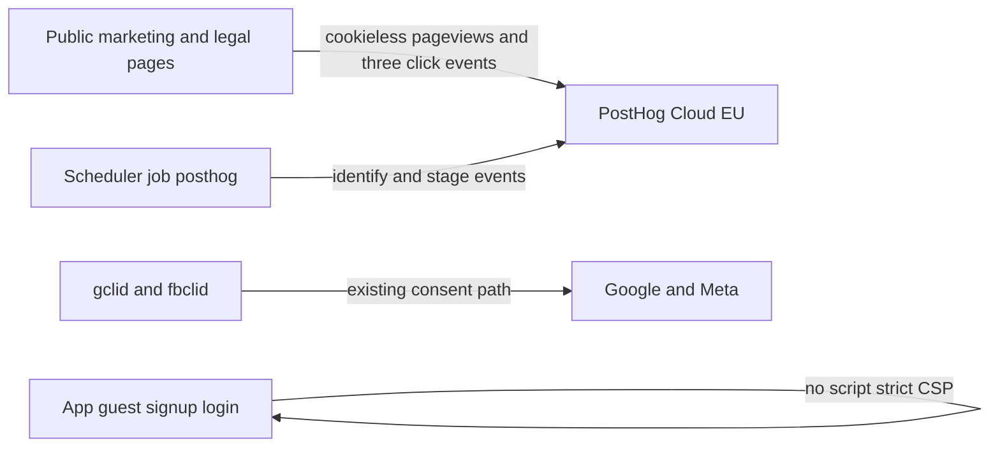

# PostHog as the data place

State: ready for the owner to merge this plan, then Composer 2.5 implements the four briefs below. This file is the design. The briefs are the build. Checked against the code on 2026-10-10.

## 0. Who does what

- **This plan's pull request** adds this file, one row in [docs/plans/README.md](docs/plans/README.md), one line in [docs/context/decisions.md](docs/context/decisions.md), a Next line in [docs/context/status.md](docs/context/status.md), the privacy bullets in [docs/context/rules.md](docs/context/rules.md), and the matching one-liner in [AGENTS.md](../../AGENTS.md). No `App/` change in that pull request.
- **Composer** runs after that pull request is on the branch it should build from. One branch, four commits, one pull request. Each commit starts by writing `docs/tasks/NNNN-*.md` from the brief in this plan (`Status: in-progress`) and ends with that brief's code. Reports come at the end. Composer does not edit this plan, `AGENTS.md`, `rules.md`, or `decisions.md`.

Decision line to append:

`2026-10-10 | PostHog replaces Umami and the funnel | owner | this plan`

`rules.md` privacy bullets become:

- No third-party scripts on app pages, guest pages or auth pages. The exceptions are Cloudflare Turnstile on sign-in and on the guest PIN/claim pages, and PostHog on the public marketing and legal pages listed in `App/app/analytics.py`.
- Analytics: PostHog Cloud EU. Cookieless page views on those public pages. Host account profiles (e-mail, workspace name, UTM, funnel stage) from the server only. No guest data. No ad click ids. Ads measurement stays as it is: explicit consent, server-side, click id only, to Google or Meta, never to PostHog.

## 1. Owner decisions (locked)

These supersede the 2026-10-05 and 2026-10-08 Umami / in-app-funnel lines, and the "PostHog not planned" line in [docs/UbyHost_workplan/03_when_triggered.md](docs/UbyHost_workplan/03_when_triggered.md).

- PostHog is the place for website measurement, the host funnel, and later CRM, marketing and sales. Build those later views in PostHog. Do not add a new dashboard in the app.
- Region: EU. Defaults `https://eu.i.posthog.com` and `https://eu-assets.i.posthog.com`. A host containing `us.i.posthog.com` or `us-assets.i.posthog.com` is refused (analytics stays off).
- Public script: cookieless, `person_profiles: "identified_only"`, `persistence: "memory"`, autocapture off, session recording off, no heatmaps, no surveys, no feature flags. Do Not Track and the opt-out skip init.
- Hosts are identified only from the server. `distinct_id` is the account id as a string. Person properties: e-mail, workspace name, `signup_source`, the three UTM fields, `funnel_stage`.
- No PostHog script on the host app, on `/l/...`, on `/login`, or on `/signup` and `/signup/verify`. The sign-up form reads `gclid` and `fbclid` ([App/tests/test_umami_guard.py](App/tests/test_umami_guard.py) `test_the_sign_up_pages_never_carry_umami`). It stays an auth page. Marketing credit for a sign-up is the UTM already stored on the account, copied onto the PostHog person by the server job.
- Ad click ids never go to PostHog: `gclid`, `gbraid`, `wbraid`, `fbclid`, the signed `click` value. The script strips them from any URL it would send. The server job never reads `ad_click`.
- Anonymous page views are not stitched to the host person. That is accepted.
- No new Python package. Capture is `urllib`.
- `/admin/funnel` charts, table and CSV are removed in brief 0036, after the server job exists. The route remains as a short link to the PostHog project.
- Lawyer review of legal v1.7 stays open. This adds a subprocessor. It does not close that review.

## 2. What exists today

Public tag, only when both Umami env values are set, only on `PUBLIC_ANALYTICS_TEMPLATES` in [App/app/analytics.py](App/app/analytics.py): `landing.html`, `product.html`, `pricing.html`, `public_guide.html`, `legal.html`, `terms.html`, `privacy.html`, `dpa.html`, `subprocessors.html`. Guest render forces `umami_tag = None` in [App/app/templating.py](App/app/templating.py). CSP widens only for a flagged response ([App/app/main.py](App/app/main.py) `_public_csp`).

Click events already in templates, as `data-umami-event`: `login_click`, `contact_click`, `signup_start`. Opt-out key `umami.disabled` in [App/app/static/umami-optout.js](App/app/static/umami-optout.js), listed in [App/app/cookie_inventory.py](App/app/cookie_inventory.py).

In-app analytics is [App/app/admin_funnel.py](App/app/admin_funnel.py). Stages, in order: `signed_up`, `email_verified`, `created`, `first_login`, `legal_accepted`, `first_entity`, `first_property`, `first_calendar`, `first_guest`, `first_filing`, `retained`. The query already returns `id`, `display_name`, `signup_source` and the stage timestamps. It does not return `email` or the UTM columns. Routes: `GET /admin/funnel` and `GET /admin/funnel.csv` in [App/app/routes/admin_accounts.py](App/app/routes/admin_accounts.py).

Scheduler jobs live in [App/app/scheduler.py](App/app/scheduler.py) `job_intervals` and `start`. Latest migration file is [App/app/migrations/0007_door_codes.sql](App/app/migrations/0007_door_codes.sql). Next file is `0008_posthog_stage.sql`.

Subprocessor id `umami` is in `SUBPROCESSOR_IDS` in [App/app/routes/legal.py](App/app/routes/legal.py). [App/tests/test_privacy_legal_positions.py](App/tests/test_privacy_legal_positions.py) asserts `SUBPROCESSOR_IDS[:5] == ("aws_lightsail", "aws_ses", "aws_s3", "cloudflare", "umami")`.

## 3. Two streams, one project



Person properties a later CRM or sales view can filter on: `email`, `workspace_name`, `signup_source`, `utm_source`, `utm_medium`, `utm_campaign`, `funnel_stage`. Events: one per stage reached, name equal to the stage key. Public events: `$pageview`, `login_click`, `contact_click`, `signup_start`.

## 4. Do not touch

UbyPort filing, guest forms, `ad_click`, Google upload, Meta CAPI, Turnstile, session cookies, door codes, invoices, `/signup` and `/signup/verify` templates except where a brief names a file. Do not put `gclid` or `fbclid` in PostHog. Do not call `identify` from the browser. Do not add a package to `requirements`.

## 5. Briefs

Run 0033, then 0034, then 0035, then 0036. 0033 and 0034 both meet `privacy.html` and the guard test: 0033 changes the mechanism, 0034 changes the sentences. 0034 must not put the word Umami back into the tag.

### 0033 — Public tracker swap

Status: todo
Depends on: none | Base commit: the plan merge | Branch: task/0033-posthog-public
Executor: Composer 2.5 | Fits one session

**Objective.** Replace the Umami tag with a PostHog cookieless snippet on the same public pages, and rename the click attribute. The sign-up and verify pages stay dark.

**Context.** Anchors the executor must find verbatim. If one is missing, stop.

[App/app/config.py](App/app/config.py), the Umami block starts:

```
# Umami Cloud page analytics, public marketing and legal pages only (WP09).
```

[App/app/templating.py](App/app/templating.py):

```
    data["umami_tag"] = analytics.tag() if analytics.mark_public_page(request, name) else None
```

and:

```
    data["umami_tag"] = None  # permanent rule: guest pages are never measured
```

[App/tests/test_umami_guard.py](App/tests/test_umami_guard.py):

```
def test_the_sign_up_pages_never_carry_umami(umami_on, monkeypatch):
    # WP20/WP21: /signup reads gclid and fbclid; it is an auth page, no tag.
```

**Files.**

- [App/app/analytics.py](App/app/analytics.py) — rewrite. Same `PUBLIC_ANALYTICS_TEMPLATES`. `enabled()` is true only when `POSTHOG_PROJECT_API_KEY` is non-empty, both hosts are `https` origins, and neither host contains `us.i.posthog.com` or `us-assets.i.posthog.com`. `script_origin()` returns the assets host. `connect_origins()` returns the API host. `tag()` returns `api_key`, `api_host`, `assets_host`, or None. Keep `mark_public_page` and `is_public_page`.
- [App/app/config.py](App/app/config.py) — delete the four `UMAMI_*` assignments. Add `POSTHOG_PROJECT_API_KEY` (default empty), `POSTHOG_HOST` (default `https://eu.i.posthog.com`, strip trailing slash), `POSTHOG_ASSETS_HOST` (default `https://eu-assets.i.posthog.com`, strip trailing slash).
- [App/app/main.py](App/app/main.py) — comments only, so they say PostHog. Keep calling `analytics.script_origin()` and `analytics.connect_origins()`.
- [App/app/templating.py](App/app/templating.py) — `umami_tag` becomes `analytics_tag` in both assignments.
- [App/app/templates/_umami.html](App/app/templates/_umami.html) — delete. Add [App/app/templates/_posthog.html](App/app/templates/_posthog.html).
- Includes of `_umami.html` become `_posthog.html` in [landing.html](App/app/templates/landing.html), [product.html](App/app/templates/product.html), [pricing.html](App/app/templates/pricing.html), [public_guide.html](App/app/templates/public_guide.html), [public_legal_base.html](App/app/templates/public_legal_base.html).
- `data-umami-event` becomes `data-analytics-event` in those templates plus [\_public_header.html](App/app/templates/_public_header.html), [\_public_footer.html](App/app/templates/_public_footer.html), [legal.html](App/app/templates/legal.html), [privacy.html](App/app/templates/privacy.html), [dpa.html](App/app/templates/dpa.html). Allowed values stay `login_click`, `contact_click`, `signup_start`. No new events.
- [App/app/templates/privacy.html](App/app/templates/privacy.html) — `` becomes ``. The opt-out script src becomes `/static/analytics-optout.js?v=20261010a`.
- [App/app/static/umami-optout.js](App/app/static/umami-optout.js) — delete. Add [App/app/static/analytics-optout.js](App/app/static/analytics-optout.js) with the same behaviour and `var KEY = "ubyhost.analytics.disabled"`.
- [App/tests/test_umami_guard.py](App/tests/test_umami_guard.py) — retarget to PostHog. Rename the file in a later pass only if every importer is updated in this same brief; otherwise keep the filename and change the assertions. Fixture sets `POSTHOG_PROJECT_API_KEY` to `phc_test`, `POSTHOG_HOST` to `https://analytics.example.invalid`, `POSTHOG_ASSETS_HOST` to `https://assets.example.invalid`. Markers are the key, both origins, and `posthog.init`. Assert `us.i.posthog.com` leaves the tag absent and the CSP strict. Assert `/signup` and `/signup/verify` still have no tag and the strict CSP, including when the URL contains `gclid` and `fbclid`. Assert the snippet source contains the strip list `gclid`, `fbclid`, `click`, `token`.
- [App/tests/test_signup.py](App/tests/test_signup.py) — `data-umami-event` becomes `data-analytics-event`. The assertion that the sign-up page has no such attribute stays.
- [App/tests/test_no_tracking.py](App/tests/test_no_tracking.py) — comment only, so it points at the guard test.

No other file may change. Copy sentences stay in 0034, even if they still say Umami for one commit.

**Steps.**

1. Replace the config block. Delete every `UMAMI_` name. A repo search for `UMAMI_` in `App/` may remain only inside 0034's files (`privacy_policy_i18n.py`, `subprocessors_i18n.py`, `cookie_inventory.py`, `landing_i18n.py`). Those are 0034. Do not edit them here.
2. Rewrite `analytics.py` as described. Refuse a non-https host the same way `_https_origin` does today.
3. Add `_posthog.html`. It prints nothing unless `analytics_tag` is set. The inline script returns immediately when `navigator.doNotTrack` or `window.doNotTrack` is `"1"`, or when `localStorage["ubyhost.analytics.disabled"]` is set. Then it loads `{{ analytics_tag.assets_host }}/static/array.js` and calls `posthog.init` with `api_host`, `cookieless_mode: "always"`, `person_profiles: "identified_only"`, `persistence: "memory"`, `autocapture: false`, `capture_pageleave: false`, `disable_session_recording: true`. `before_send` removes the query keys `gclid`, `gbraid`, `wbraid`, `fbclid`, `click`, `token`, `email` and the hash from `$current_url`, `$referrer` and `$pathname`. `loaded` listens for clicks on `[data-analytics-event]` and calls `capture` only for `login_click`, `contact_click` and `signup_start`. The inline script must not contain the word `identify`.
4. Point the five includes at `_posthog.html` and rename the data attributes.
5. Update the guard test and `test_signup.py` as in the file list.
6. From `App/`: `.venv/bin/python -m pytest tests/test_umami_guard.py tests/test_signup.py tests/test_no_tracking.py -q`. Expected: pass, 0 failed. Then `.venv/bin/python -m pytest tests -q`. Expected: the same pass count as before this brief, 0 failed. UI: screenshots of `/` and `/privacy` at 360, 390 and 1280 px in the report, with the key set in the test client or a local env. Do not commit a real `phc_` key.

**Do not touch.** `admin_funnel.py`, `scheduler.py`, migrations, guest templates, signup templates, filing, `requirements*.txt`, privacy copy strings.

**Stop and ask** on the template conditions in [docs/tasks/TEMPLATE.md](docs/tasks/TEMPLATE.md) section 8, and if making the US host refused forces a CSP that the stand-in test cannot derive from config.

**Acceptance.**

- Unset key: public HTML has no `posthog`, CSP equals `_CSP`.
- Set key: public pages contain `posthog.init` and the CSP allows the configured assets host on `script-src` and the API host on `connect-src`.
- `/signup?gclid=TEST&fbclid=TEST`, `/login`, `/l/...`, and a signed-in `/reservations` stay on `_CSP` with no `posthog`.
- Opt-out script writes `ubyhost.analytics.disabled` and only `/privacy` loads it.
- No `identify(` in `App/app/templates` or `App/app/static`.

**Owner steps.** None in this brief. The key stays unset until 0034's copy is deployed and you have done the steps in section 6.

### 0034 — Copy and subprocessor

Status: todo
Depends on: 0033 | Base commit: 0033's commit | Branch: same branch
Executor: Composer 2.5 | Fits one session

**Objective.** Say PostHog, in English and Czech, in the privacy policy, the subprocessor register, the cookie inventory and the landing line. Remove Umami from those texts.

**Files.**

- [App/app/privacy_policy_i18n.py](App/app/privacy_policy_i18n.py) — replace `privacy.analytics_body` and `privacy.optout_lede` in `en` and `cs`. Add `privacy.product_analytics_title` and `privacy.product_analytics_body` in both. Do not claim § 89(3) for the host-profile paragraph. The website paragraph may say legitimate interest and that the measurement is aggregated page statistics. Exact English website body: "On our public pages (not in the app, not on guest pages and not on sign-in) we use PostHog Cloud EU, operated by PostHog, Inc., with data stored in the EU (Frankfurt), to count visits. The measurement is set not to store a cookie and not to store your IP address. PostHog derives a short-lived visit identifier, and we see aggregated statistics (pages viewed, referring site, browser, device type, country). We do not use this for advertising. Legal basis: our legitimate interest in understanding how our website is used (Art. 6(1)(f) GDPR). You can switch measurement off in this browser here:". Exact English product body: "For our marketing and sales picture we also send PostHog, from our own server, the host account e-mail, the workspace name, the campaign labels of the sign-up link (utm_source, utm_medium, utm_campaign), the sign-up source, and how far the account has got. We do not send guest data, passport details, stay contents, door codes or advertising click identifiers. Legal basis: our legitimate interest in operating the service (Art. 6(1)(f) GDPR)." Czech: translate those two paragraphs in the same formal register as the current Umami paragraph. Do not mention Umami.
- [App/app/templates/privacy.html](App/app/templates/privacy.html) — inside the existing `` block, after the website paragraph, print the new title and body. Do not change the opt-out markup except the script name 0033 already set.
- [App/app/subprocessors_i18n.py](App/app/subprocessors_i18n.py) — rename keys `umami_*` to `posthog_*` in `en` and `cs`. Provider: "PostHog, Inc. (PostHog Cloud EU)". Purpose: "Website statistics on public pages, and host-account product measurement for the operator." Data: "Public page views and the three click events; for a host account, e-mail, workspace name, UTM labels, sign-up source and funnel stage. No Guest Data. No advertising click identifiers." Location: "EU, Frankfurt. Used only while the operator enables it." Safeguard: "PostHog DPA."
- [App/app/routes/legal.py](App/app/routes/legal.py) — `"umami"` in `SUBPROCESSOR_IDS` becomes `"posthog"`.
- [App/tests/test_privacy_legal_positions.py](App/tests/test_privacy_legal_positions.py) — the five-id assertion ends with `"posthog"`.
- [App/app/cookie_inventory.py](App/app/cookie_inventory.py) — row name `ubyhost.analytics.disabled`, `set_by` `static/analytics-optout.js`. Purpose and the `COOKIELESS_SERVICES` entry say PostHog, no cookies, public pages only, EU. Update the `de` / `es` / `fr` extra strings for that key the same way. Delete `umami.disabled`.
- [App/app/landing_i18n.py](App/app/landing_i18n.py) — `privacy_first.trackers.body` in `en` and `cs`. English: "No ad or analytics scripts in the app or on guest pages. Website statistics run on public pages only, with PostHog Cloud EU."
- [docs/ENVIRONMENT.md](docs/ENVIRONMENT.md) — replace the "Page analytics (Umami)" section with PostHog: `POSTHOG_PROJECT_API_KEY`, `POSTHOG_HOST`, `POSTHOG_ASSETS_HOST`. State that both hosts default to EU, a US host is ignored, and the tag is absent until the key is set.
- Guard test assertion that the privacy page and the subprocessor page describe the vendor: they must contain "PostHog" and must not contain "Umami".

**Do not touch.** The Google Ads and Meta paragraphs (`privacy.signup_ads_*` and the Meta twins). The click-id consent flow. `analytics.py`.

**Commands.** From `App/`: `.venv/bin/python -m pytest tests/test_umami_guard.py tests/test_privacy_legal_positions.py tests/test_privacy_first.py -q`. Then the full suite. From the repo root: `python3 scripts/context_lint.py`. Screenshots of `/privacy` and `/subprocessors` at 360, 390 and 1280 px, English and Czech.

**Acceptance.** A search of `App/` for `umami` finds nothing. `/privacy` shows the website paragraph, the product paragraph and the opt-out. `/subprocessors` lists PostHog, Inc. The Google Ads paragraph still says the click id goes to Google, not to PostHog.

### 0035 — Host profiles and stage events

Status: todo
Depends on: 0033 | Base commit: 0034's commit | Branch: same branch
Executor: Composer 2.5 | Fits one session

**Objective.** A scheduler job sends each host's reached funnel stages and person properties to PostHog. This is the in-app analytics move. Failures never block filing, sign-up or login.

**Context.** Anchor in [App/app/scheduler.py](App/app/scheduler.py):

```
        "door_codes": 1,
```

and the `_job_meta_capi` function, which is the pattern: catch exceptions, `_job_failed`, `_log_run` with counts only.

Anchor in [App/app/admin_funnel.py](App/app/admin_funnel.py): `def stages()`. Use that order. Do not rewrite the funnel SQL.

**Files.**

- [App/app/migrations/0008_posthog_stage.sql](App/app/migrations/0008_posthog_stage.sql) — `ALTER TABLE user_account ADD COLUMN posthog_stage TEXT;` Comment: last funnel stage successfully sent to PostHog. Not guest data. No `retention.py` line: the value is a stage key the product already computes.
- [App/app/posthog_sync.py](App/app/posthog_sync.py) — new. `sync() -> dict` with integer counts `sent`, `skipped`, `failed`.
- [App/app/scheduler.py](App/app/scheduler.py) — job id `posthog`, every 15 minutes, same shape as `_job_meta_capi`. Add `"posthog": 15` to `job_intervals`.
- [App/app/host_i18n.py](App/app/host_i18n.py) — `notification.job_name.posthog` in `en` ("product analytics") and `cs` ("produktová analytika"), next to the `door_codes` job name keys.
- [App/tests/test_posthog_sync.py](App/tests/test_posthog_sync.py) — new.

**Behaviour of `sync`.**

- If `analytics.enabled()` is false, return zeros and send nothing.
- Load `admin_funnel.rows()`. Separately query `id, email, username, signup_utm_source, signup_utm_medium, signup_utm_campaign, posthog_stage` from `user_account` where `role = 'host'`. Match on `id`. Do not add those columns to `_SQL`.
- E-mail property: `email` if set, otherwise `username` only when it contains `@`. Omit when neither applies.
- Person `$set`: `email`, `workspace_name` from `display_name`, `signup_source` only when it is `google`, `meta` or `none`, the three UTM fields when non-empty, `funnel_stage`. No other keys. Never `signup_source_present`. Never a value that looks like a click id (if a UTM value contains `gclid` or `fbclid`, skip that field).
- Stage order is `stages()`. Let `previous` be `posthog_stage` and `current` be `row["stage"]`. Send one capture per stage after `previous` up to and including `current`. Event name is the stage key. `distinct_id` is `str(id)`. Timestamp is that stage's column on the row when it is a datetime string, otherwise omit. After a successful send of the current stage, `UPDATE user_account SET posthog_stage = ? WHERE id = ?`.
- HTTP: `POST {POSTHOG_HOST}/capture/` with `Content-Type: application/json`, timeout 3 seconds, body `api_key`, `event`, `distinct_id`, `properties`. Put `$set` inside `properties` on every event. Set `properties["$ip"]` to `null` so the library's JSON null is sent. Use `urllib.request`. On HTTP error or timeout, increment `failed`, log the account id and the status only, leave `posthog_stage` unchanged, continue to the next account.
- Do not log e-mail, UTM or the response body.

**Tests.** Use a local `http.server` or a monkeypatched `urlopen`. Cases: key unset sends nothing; a host at `first_property` sends the stages up through `first_property` and stores that key; a second run sends nothing; a failed POST does not advance the column; the JSON has no `gclid`, no guest field, and `$ip` null; `distinct_id` equals the account id.

**Commands.** `.venv/bin/python -m pytest tests/test_posthog_sync.py tests/test_admin_funnel.py -q` then the full suite. `python3 scripts/context_lint.py`.

**Do not touch.** Templates, the funnel page, CSV, guest tables, `ad_click`.

**Acceptance.** With the key set, one scheduler run backfills current hosts and a second run sends 0. With the key unset, the job logs nothing and changes no row. A downed endpoint does not raise out of `_job_posthog`.

### 0036 — Retire the in-app dashboard

Status: todo
Depends on: 0035 | Base commit: 0035's commit | Branch: same branch
Executor: Composer 2.5 | Fits one session

**Objective.** `/admin/funnel` stops being a dashboard. It becomes a short admin page with one link to the PostHog project. The CSV route goes away. `admin_funnel.rows()` stays, because 0035's job calls it.

**Files.**

- [App/app/templates/admin_funnel.html](App/app/templates/admin_funnel.html) — replace with a title, one sentence ("Host and campaign figures are in PostHog."), and a link when `posthog_url` is set. No table, no chart, no e-mail.
- [App/app/routes/admin_accounts.py](App/app/routes/admin_accounts.py) — `funnel_admin` no longer calls `overview` or `weekly`. It passes `posthog_url`: `https://eu.posthog.com` when the key is set, else empty. Delete `funnel_admin_csv` and its imports that become unused.
- [App/app/config.py](App/app/config.py) — `POSTHOG_APP_URL` default `https://eu.posthog.com`. The page links there only when analytics is enabled. Do not build a project-specific URL that needs another secret.
- [App/tests/test_admin_funnel.py](App/tests/test_admin_funnel.py) — delete assertions that the HTML contains the chart, the account table or `data-account`. Keep tests of `rows()`, `stages()` and the CSV helper if 0035 still needs `rows()`. Add: the page contains the PostHog sentence; the CSV path returns 404; a guest path is unaffected.
- [App/app/static/app.css](App/app/static/app.css) — delete the "Funnel dashboard (0018)" block only. Leave every other rule.
- i18n keys used only by the deleted markup: remove them in [App/app/host_i18n.py](App/app/host_i18n.py) if nothing else references them. If a test still requires `Účty podle fáze`, stop and ask rather than keeping the chart.

**Commands.** `.venv/bin/python -m pytest tests/test_admin_funnel.py tests/test_posthog_sync.py -q` then the full suite. Screenshots of `/admin/funnel` at 360, 390 and 1280 px while signed in as admin.

**Acceptance.** `/admin/funnel.csv` is 404. `/admin/funnel` has no `<table>` and no host e-mail. `posthog_sync.sync` still sends stages. Guest and host app pages still have the strict CSP.

## 6. Owner steps after the Composer pull request is merged

1. In PostHog, create the project in the EU region.
2. Turn on Cookieless server hash. Confirm IP capture is off. Turn session replay off.
3. Sign the PostHog DPA and file it with the other processor agreements.
4. Put `POSTHOG_PROJECT_API_KEY` in staging, deploy, open the marketing home page, and confirm a page view in the EU project. Open `/signup?gclid=test` and a guest link and confirm the response has no `posthog`.
5. Wait for one scheduler run. Open one host person. Confirm e-mail, UTM and `funnel_stage`. Confirm no `gclid`.
6. Repeat the key on production when staging looks right. Tell the lawyer the subprocessor paragraph is in the privacy policy.

## 7. Later, not in these briefs

Cohorts by `funnel_stage`, campaign breakdown on the UTM properties, and time-to-first-filing are PostHog views, not app work. A CRM sync to an outbound mail tool is a new decision when the tool is chosen. Still out: session replay, feature flags, a script on the host app, guest analytics, copying click ids.

## 8. Composer prompt

Paste this in a new Composer 2.5 chat after this plan is in the repository:

```
Read AGENTS.md, then docs/plans/posthog-analytics.md. You are the executor. Implement briefs 0033, 0034, 0035 and 0036 from that plan, in that order, as four commits on one branch. Before editing code for a brief, write docs/tasks/NNNN-*.md by copying that brief from the plan and set Status: in-progress. Follow the brief exactly, including its copy and its code. Open only the files that brief names. If a stop condition happens, stop and write the report. Do not edit docs/plans/, AGENTS.md, docs/context/rules.md or docs/context/decisions.md. Finish by writing each docs/tasks/NNNN-report.md in the template's section 9 format, set each brief to Status: review, and open one pull request.
```
