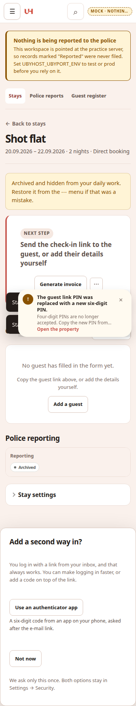
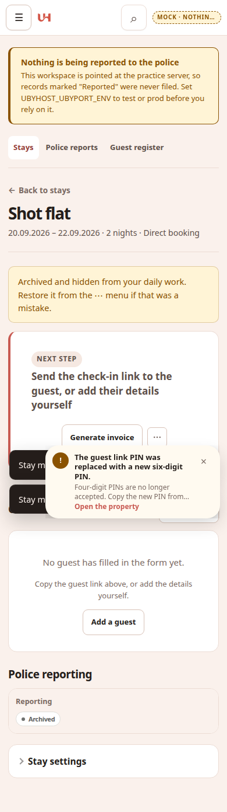
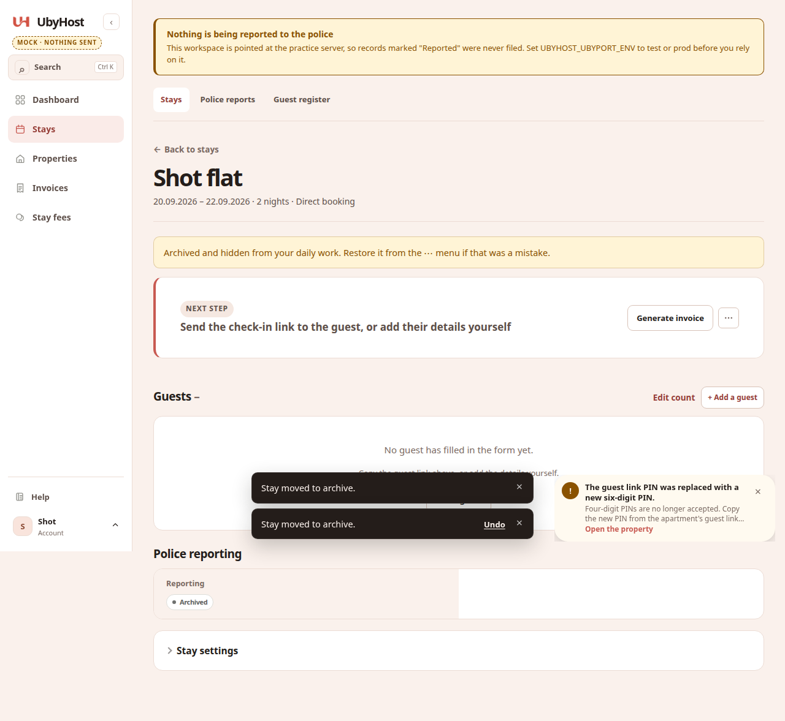

# 0017 report: Archive keeps you on the same page

Status: review

## 1. Files changed

```
 App/app/routes/admin.py                      | 28 +++++++++++++++++-----
 App/app/templates/apartment_form.html        |  1 +
 App/app/templates/apartments.html            |  1 +
 App/app/templates/reservation_detail.html      |  2 +-
 App/tests/test_archive_stays_on_page.py      | 217 +++++++++++++++++++++++++++++++++
 docs/tasks/0017-archive-stay-on-page.md      |  2 +-
 docs/tasks/0017-screenshots/stay-archived-360.png
 docs/tasks/0017-screenshots/stay-archived-390.png
 docs/tasks/0017-screenshots/stay-archived-1280.png
```

## 2. Commands

`cd App && .venv/bin/python -m pytest tests/test_archive_stays_on_page.py tests/test_destructive_confirm.py tests/test_accounts.py -q`

```
39 passed, 1 warning in 2.32s
```

`cd App && UBYHOST_REQUIRE_BROWSER=1 .venv/bin/python -m pytest tests -q`

```
2840 passed, 2 skipped, 7 warnings in 310.95s (0:05:10)
```

`cd App && .venv/bin/python -m pytest tests/test_host_geometry.py tests/test_guest_browser_e2e.py -q`

```
18 passed, 1 warning in 174.33s (0:02:54)
```

`python3 scripts/context_lint.py`

```
context lint: OK
```

`grep -n "range=archive" App/app/routes/admin.py`

```
(no output)
```

## 3. Acceptance (§7)

- [x] Archive a stay from the stay page: URL stays on `/reservations/{id}` with `undo_stay` / `undo_return`; Undo toast visible (screenshots below).
- [x] Undo path unchanged (`base.html` + `unarchive` routes not touched); redirect target after archive is the same page with undo query.
- [x] Property form archive posts `return_to=/apartments/{id}` (covered by test).
- [x] No `range=archive` in `admin.py` archive routes.
- [x] Full suite green; browser + geometry 18 passed, 0 skipped.

### Stay page after archive (Undo toast)

| Width | Screenshot |
|------:|------------|
| 360 |  |
| 390 |  |
| 1280 |  |

## 4. Deviations

None.

## 5. Questions

None.

## 6. Owner steps left

1. Merge the PR with `scripts/merge-pr-on-green.sh <pr>` when CI is green.
2. Deploy when you want it live.
