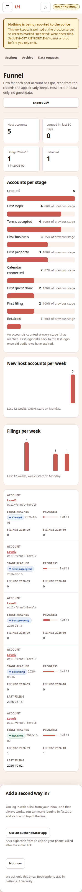
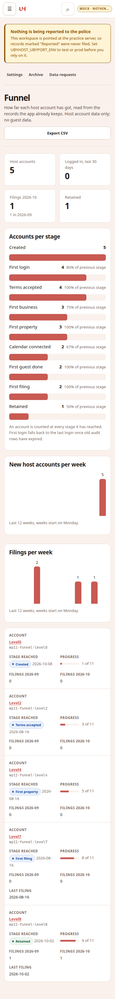
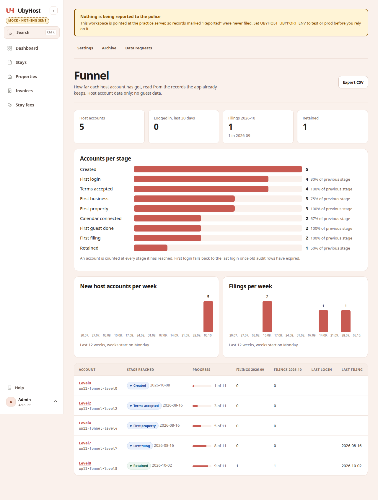
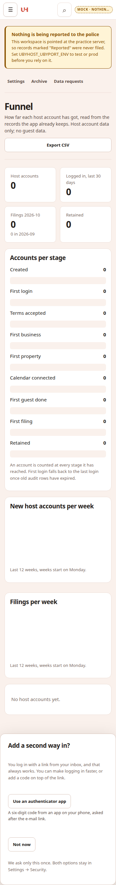
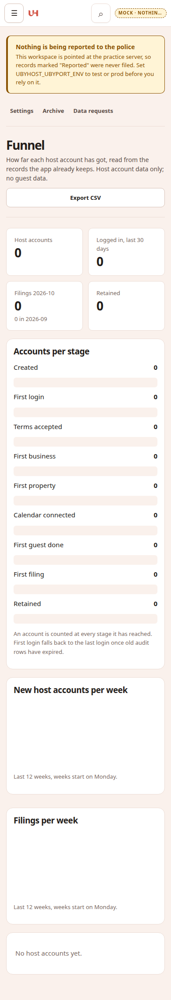
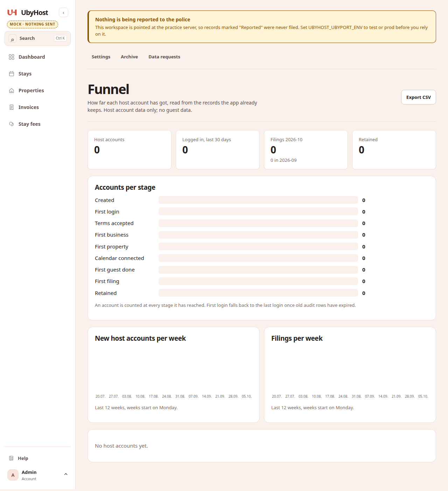

# 0018 report: Funnel dashboard

Status: review

## 1. Files changed

```
 App/app/admin_funnel.py             | 87 ++++++++++++++++++++++++++++++++++++-
 App/app/host_i18n.py                | 18 ++++++++
 App/app/routes/admin_accounts.py    |  7 ++-
 App/app/static/app.css              | 24 ++++++++++
 App/app/templates/admin_funnel.html | 55 ++++++++++++++++++-----
 App/tests/test_admin_funnel.py      | 57 ++++++++++++++++++++++++
 docs/tasks/0018-funnel-dashboard.md |  1 +
 docs/tasks/0018-report.md           | (this file)
 docs/tasks/0018-screenshots/*.png   |  6 screenshots
```

`docs/context/architecture.md` has no `admin_funnel.py` line (§3: no edit).

## 2. Commands

`cd App && .venv/bin/python -m pytest tests/test_admin_funnel.py tests/test_host_geometry.py tests/test_wp28_geometry.py -q`

```
18 passed, 1 warning in 8.58s
```

`cd App && .venv/bin/python -m pytest tests -q`

```
2836 passed, 2 skipped, 7 warnings in 313.39s (0:05:13)
```

`python3 scripts/context_lint.py`

```
WARN  2 commit(s) touched App/ after the last status.md update. Orchestrator: update docs/context/status.md at review.
next free: task 0019 | migration 0008
context lint: OK
```

## 3. Acceptance (§7)

- [x] `/admin/funnel` shows four stat cards, funnel bars, two weekly charts, slim table (server-rendered).
- [x] Screenshots below at 360, 390 and 1280 px (seeded hosts at stages 0, 2, 4, 7, 8; empty DB with admin only).
- [x] No `<script>` in `admin_funnel.html`; no new dependency or outbound request; `git diff --stat` matches §3 implementation files plus this report, brief status, screenshots.
- [x] CSV export unchanged (`test_csv_has_the_same_rows_as_the_page` passes).
- [x] Full suite green.

### Screenshots (seeded)

| 360 px | 390 px | 1280 px |
|---|---|---|
|  |  |  |

### Screenshots (empty)

| 360 px | 390 px | 1280 px |
|---|---|---|
|  |  |  |

## 4. Deviations

None.

## 5. Questions

None.

## 6. Owner steps left

1. Merge with `scripts/merge-pr-on-green.sh <pr>` when CI is green.
2. Deploy when ready; open Admin → Funnel and spot-check counts against Admin → Users.
