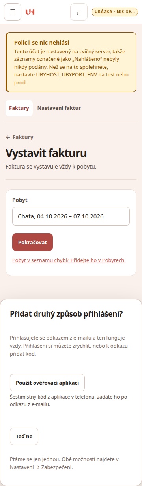
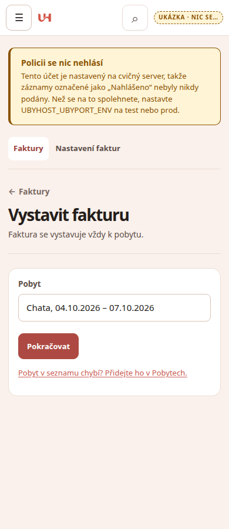
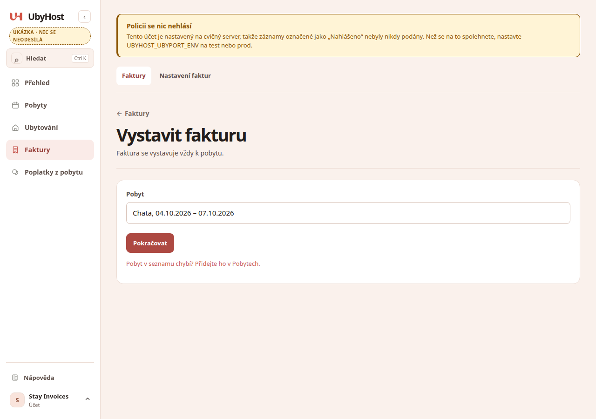
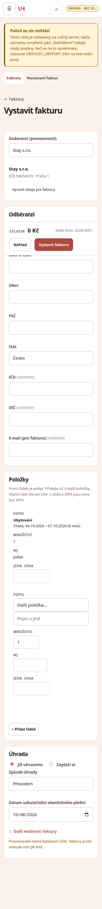
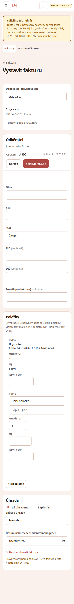
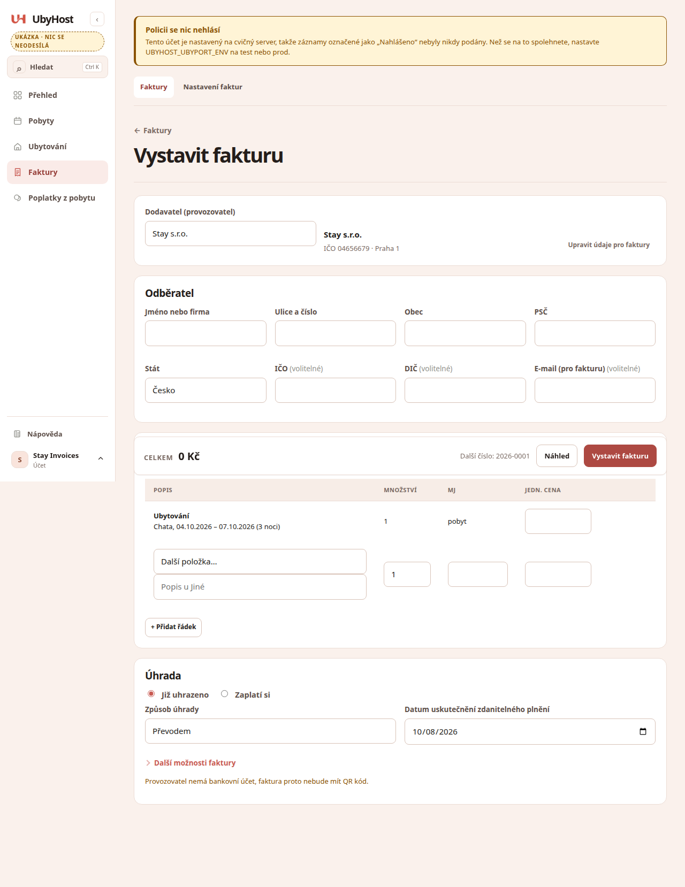
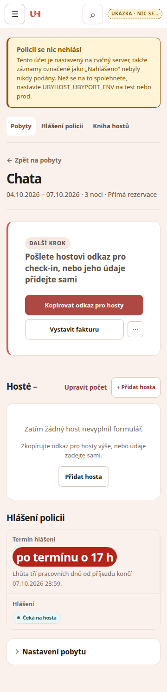
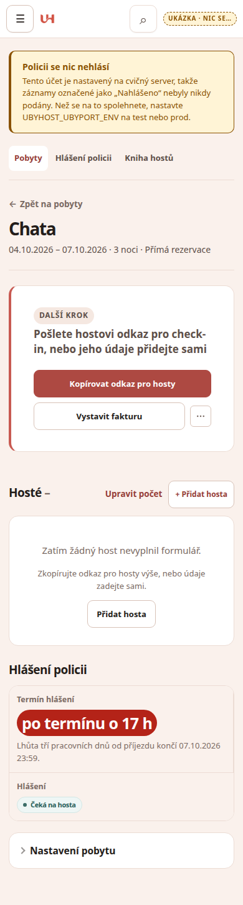
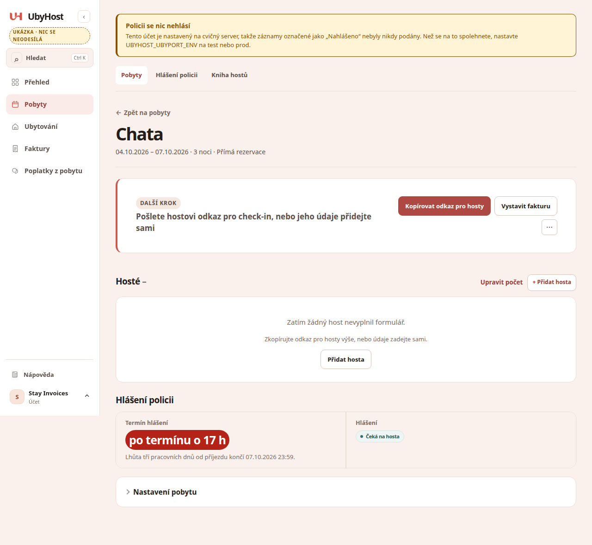

# 0020 report: Stay invoice pages

Status: review

## 1. git diff --stat

```
 App/app/host_i18n.py                      |  72 +++++++++++++++-
 App/app/invoices.py                       |   6 +-
 App/app/routes/admin.py                   |   2 +
 App/app/routes/invoices.py                | 132 +++++++++++++++++++++++++-----
 App/app/templates/invoice_form.html       |  62 ++++++++++++--
 App/app/templates/invoice_stay_picker.html|  (new)
 App/app/templates/reservation_detail.html |   6 +-
 App/tests/invoice_stay_helper.py          |  (new)
 App/tests/test_invoice_entity.py          |   2 +
 App/tests/test_invoice_settings.py        |   7 +-
 App/tests/test_invoice_stay_browser.py    |  (new)
 App/tests/test_invoice_stay_pages.py      |  (new)
 App/tests/test_invoice_ux.py              |  33 +++++---
 App/tests/test_invoice_workspace.py       |  24 ++++--
 App/tests/test_property_names_in_mail.py  |  38 +++++++---
 docs/context/known-issues.md              |   2 +-
 docs/tasks/0020-screenshots/*.png         |  9 files
 docs/tasks/0020-stay-invoice-pages.md     | Status → review
```

## 2. Commands (§6)

```
.venv/bin/python -m pytest tests/test_invoice_stay_pages.py -q
9 passed, 1 warning in 1.31s
```

```
UBYHOST_REQUIRE_BROWSER=1 .venv/bin/python -m pytest \
  tests/test_invoice_stay_browser.py tests/test_host_geometry.py tests/test_wp28_geometry.py -q
11 passed, 1 warning in 10.33s
```

```
.venv/bin/python -m pytest tests -q
2897 passed, 2 skipped, 7 warnings in 315.88s
```
(2 skipped are pre-existing elsewhere; stay browser + geometry: 0 skipped.)

```
python3 scripts/context_lint.py
context lint: OK
```

## 3. Acceptance (§7)

- [x] GET /invoices/new shows stay picker; works without JS (`method="get"`)
- [x] POST without stay creates nothing (tests 2, 3)
- [x] Other host's stay refused (test 4)
- [x] Issued invoice has reservation_id, stay_label, accommodation line, PDF (test 5)
- [x] Second invoice → first; stay page shows Invoice number (tests 6, 8)
- [x] Property operator forced (test 7)
- [x] Browser/geometry 0 skipped; 9 screenshots
- [x] Old-test changes listed below
- [x] Diff only §3 files (+ report/brief/screenshots)

## 4. Deviations / old-test changes

- Merged #318 (`claude/bold-ride-leloxm` → main) first; 0019 was not on main.
- `test_invoice_ux._items()` now embeds `stay_form(make_stay(...))` so `test_host_redesign` (imports `_items`, outside §3) keeps working.
- `test_a_payers_issued_invoice_shows_the_vat_breakdown`: totals 2240/2000/240 → 13440/12000/1440 (stay 10000@12% + item).
- `test_switching_operator…`: fetch URL expects `reservation_id=`.
- `test_an_invoice_without_a_stay_keeps_the_plain_subject`: route requires a stay; issues via `invoices.issue` with `stay=None` (0019 library path) then send — beyond pure step-14 moves (invoice rows are immutable after issue).

## 5. Screenshots

| | 360 | 390 | 1280 |
|---|---|---|---|
| picker |  |  |  |
| form |  |  |  |
| stay |  |  |  |

## 6. Questions

None.

## 7. Owner steps left

1. Merge with `scripts/merge-pr-on-green.sh` when CI is green.
2. Deploy when you like.
3. Smoke: stay → Vystavit fakturu → price → Vystavit → check PDF stay line; reopen stay → Faktura \<number\>.
